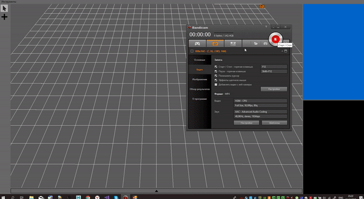
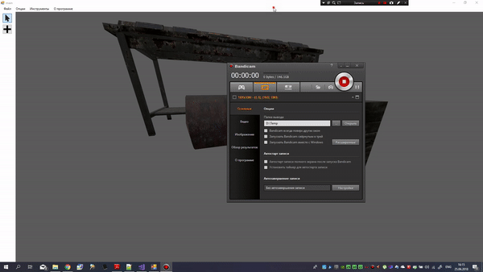

# Progressive-Engine

- support load *.obj, pObj - models;
- textures;
- lights;
- mouse - camera;
- instansing;
- game editor.

## Demonstration

### Paste model from editor

### diffuse + ambient light(avarage normal)
[.gif)](https://youtu.be/PwzfNL9KUh4)

### ambient + diffuse + specular lighting(avarage normal's)
[.gif)](https://youtu.be/Vm6YzZEDZT4c)

### Ray tracking and picker algorithm's

